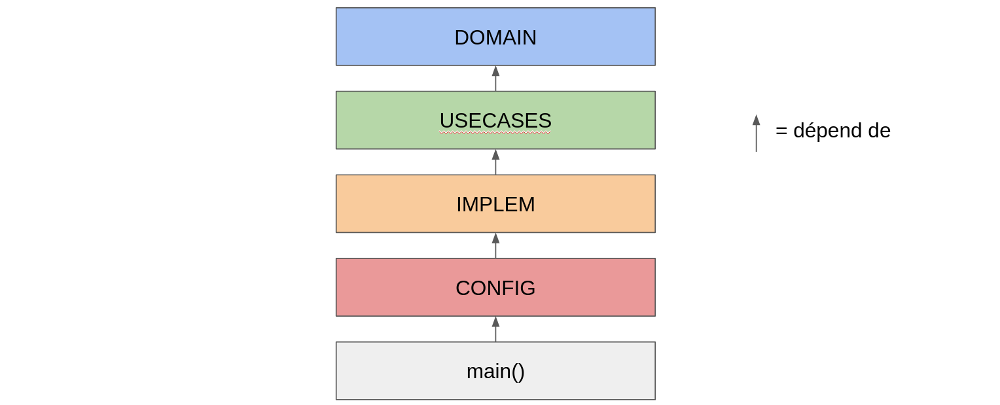

# clean architecture
---

## Principe

_Rien de bien nouveau_

- Abstraction et dépendances pointent dans la même direction |
- Séparation strict des niveaux d'abstraction
- ... en particulier : de la logique et de son implémentation |

---

---

## DOMAIN

Les règles métier générales

- Constantes  |
- Mécanismes généraux |

---

## USECASES

Logique métier pure

- Déclaration des interfaces nécessaires (non-implémentées) |
- Utilisation de ces interfaces dans des procédures métier |
- Utilisation des règles DOMAIN |

---

## IMPLEMENTATION

Implémentation des interfaces définies à la couche USECASES
- CRUD, routing HTTP, formatage JSON |
- Appel de la couche USECASES |
- Mapping entre structures de la couche USECASES et celles de la couche IMPLEMENTATION (dans les 2 sens) |

---

## CONFIG

Helper pour settings de la couche IMPLEMENTATION (via env vars, flags etc.) :
- Récupération de credentials  |
- Infos de connexion (host, port etc.) |

---

## Main()

Là où tout est “branché” ensemble
- Instantiation des structures implémentant les interfaces grace au settings de la couche configuration. |

---
## Exemple
---?code=code/uc/create_user.go&lang=golang&title=Use Case
@[8-12]()
@[14-22]()
@[25-32]()
@[34]()
@[35-42]()

---

## Avantages
- Tests  |
  - Séparation stricte des niveaux d’abstraction. |
- Possibilité d’acquérir des connaissances domaine avant les choix d’implémentation |
- Pivot rapide  |
- Niveau sémantique des méthodes "métier" |

---

## Risques

- Null Reference |
  - plug au runtime |
  - Instantiation d’un Interactor vide ou incomplet |
- Connaissance implicite de l’implémentation |  
  - Interfaces propres à l’implémentation |

---

## Questions ?